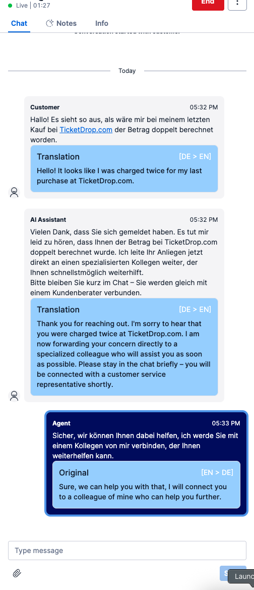

## What

- It is a Flex Plugin to translate automatically Chat messages.

- For Flex 2.0

- It starts translating automatically, customer language is based on the task attribute "language", agent language is based on worker attribute "language". Both default to env provided variables. 

## Create an Account at OpenAI

- It is the service this Plugin is using for Translations.

- Sign up for free [here](https://platform.openai.com/signup)

## How to install:

#### First, the function:

1. `cd translator-functions`
2. `npm install`
3. rename `.env.example.` to `.env.` and follow the instructions of this file.
4. `npm deploy`

#### Now, the Flex Plugin:

1. `cd ../plugin-chat-translation`
2. `npm install`
3. rename `.env.example.` to `.env.` and follow the instructions of this file.
4. `twilio flex:plugins:start` to test things locally.
5. Provided both task and worker have "language" attribute with different values, you should see the translated messages. 
6. If you are happy, deploy the plugin: `twilio flex:plugins:deploy --changelog "I love Flex"` and then `twilio fex:plugins:release ....`

